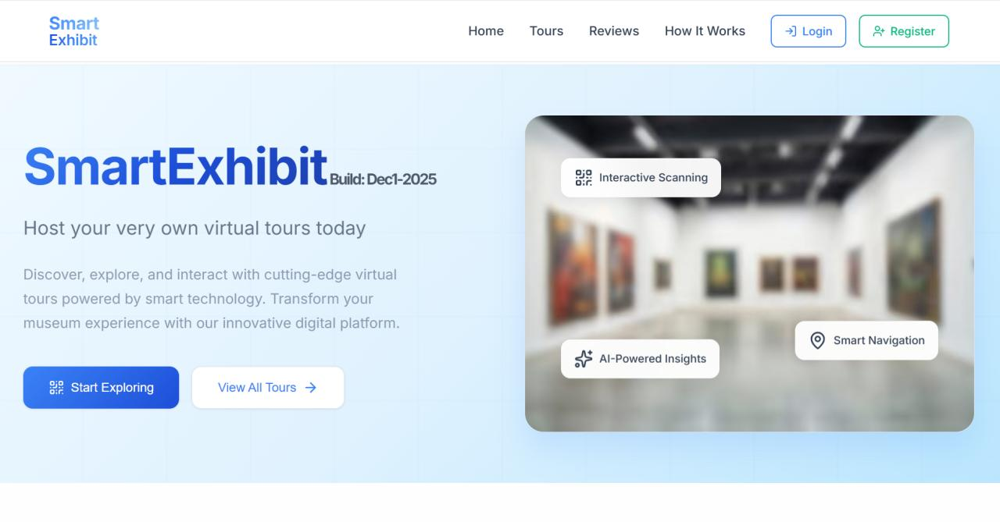
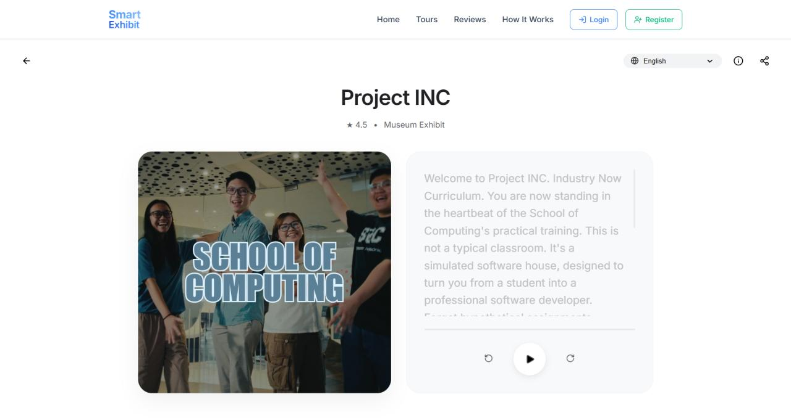
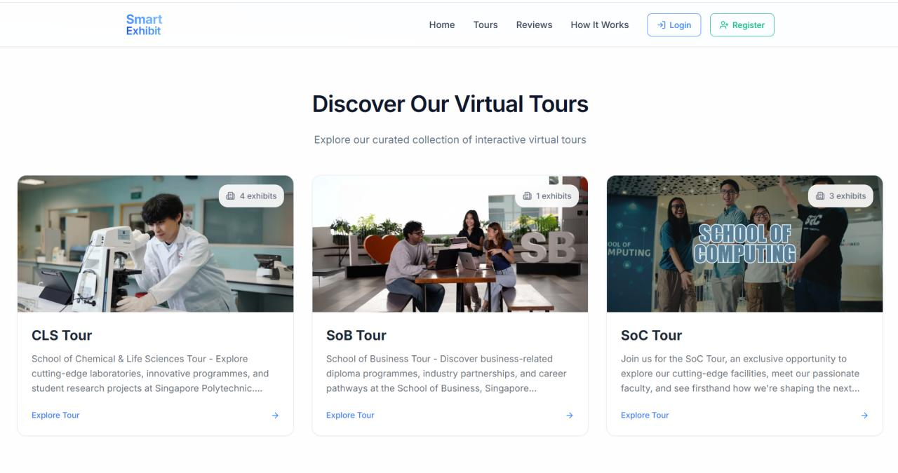
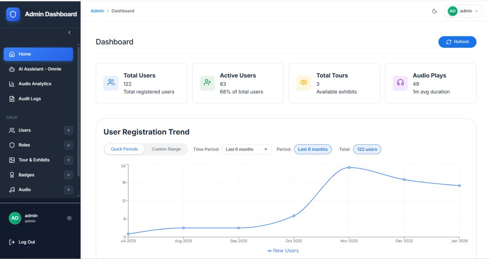
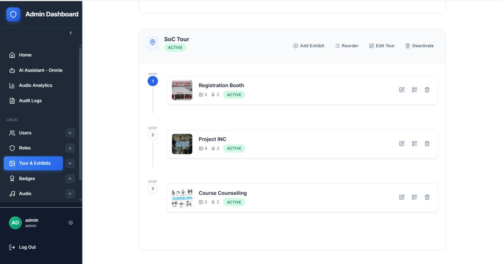
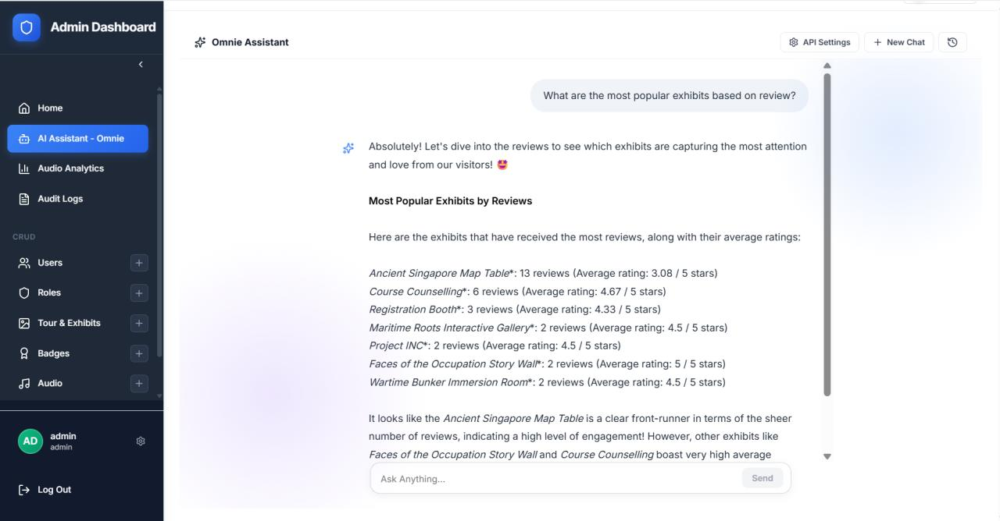

# Digital Audio Guide

A QR-based digital audio guide web application that enables self-guided tours using visitors' personal devices. The system replaces traditional handheld audio devices with a mobile-friendly web experience accessible via QR codes placed at each exhibit.

Originally built to help a museum phase out its legacy handheld audio devices, the system has since been designed to be scalable for any museum or exhibition — with a fully configurable admin dashboard that allows institutions to manage their own exhibits, tours, audio content, and visitor experience without code changes.

Built as a full-stack web application with a Node.js/Express API backend, React/TypeScript frontend, and PostgreSQL database. Deployed on Azure App Service with automated CI/CD pipelines via GitHub Actions.

---

## Screenshots

### Visitor Experience

| Home Page | Exhibit Page | Tour Page |
|:---------:|:-----------:|:---------:|
|  |  |  |
| Smart navigation and QR-based exhibit access | Multi-language audio guide with playback controls | Browse and start self-guided or virtual tours |

### Admin Dashboard

| Overview | Tour Management | AI Assistant |
|:--------:|:---------------:|:------------:|
|  |  |  |
| Key metrics and user registration trends | Sequence and reorder exhibits per tour | Gemini-powered chat for real-time data insights |

---

## Features

### Visitor Experience
- **QR Code Scanning** — Visitors scan QR codes at exhibits to access audio guides and exhibit information directly on their personal devices
- **Audio Guide Playback** — Text-to-speech audio guides with play/pause, rewind, and forward controls; supports multiple languages (English and Mandarin)
- **Language Preference** — Persistent audio language preference retained across the entire visit
- **Self-Guided Tours** — Sequential tour mode that guides visitors through exhibits in a defined order with a tour summary at the end
- **AR Photobooth** — Augmented reality photobooth experience integrated via 8th Wall
- **Exhibit Reviews** — Visitors can submit ratings and written reviews for individual exhibits
- **Badge System** — Visitors earn achievement badges upon visiting exhibits or completing tours
- **User Profiles** — Account registration with email verification, profile pictures, and username management

### Admin Dashboard
- **Exhibit and Exhibition Management** — Full CRUD for exhibits and exhibitions, including exhibit sequencing via drag-and-drop reordering
- **Audio Management** — Upload and manage audio files per exhibit and language
- **Badge Management** — Create and assign badges to exhibits with custom styles and images
- **Clickable Elements** — Configure up to 3 floating interactive elements per exhibit that link visitors to external URLs
- **Review Management** — View, filter, and moderate visitor reviews; toggle visibility of individual reviews
- **User and Role Management** — Manage user accounts, assign roles, and configure permissions
- **Audit Logs** — Track administrative actions across the system
- **AI Assistant (Omnie)** — Gemini-powered AI assistant that answers queries about visitor statistics, audio analytics, exhibit data, and user demographics using real-time database context
- **Analytics Dashboards**
  - Exhibition visitor statistics with bar chart comparisons
  - Audio playback analytics (play counts, completion rates, average listen duration per exhibit)
  - Badge analytics
  - Review analytics with export functionality
- **Settings** — Configure AI model, Gemini API key, and application-level settings

---

## Tech Stack

**Backend**
- Node.js with Express 5
- Prisma ORM with PostgreSQL (Neon)
- JWT authentication (access + refresh tokens)
- Google Cloud Text-to-Speech API
- Google Gemini API (`@google/genai`)
- Nodemailer for transactional email
- Multer for file uploads
- Winston for structured logging

**Frontend**
- React 18 with TypeScript
- Vite
- Tailwind CSS
- Recharts for data visualisation
- Framer Motion for animations
- `@dnd-kit` for drag-and-drop sequencing
- `html5-qrcode` for QR scanning
- Playwright for end-to-end testing

**Infrastructure**
- Azure App Service (deployment)
- Neon PostgreSQL (database)
- GitHub Actions (CI/CD)

---

## Getting Started

### Prerequisites
- Node.js 20 or higher
- A PostgreSQL database (Neon or local)

### Environment Variables

Create `api/.env` with the following:

```
DATABASE_URL=your_postgresql_connection_string
JWT_SECRET_KEY=your_jwt_secret
JWT_REFRESH_SECRET=your_jwt_refresh_secret
SETTINGS_ENCRYPTION_KEY=your_32_char_encryption_key
EMAIL_USER=your_email@gmail.com
EMAIL_PASS=your_gmail_app_password
FRONTEND_URL=http://localhost:5173
```

Create `web/.env.development` with:

```
VITE_API_TARGET=http://localhost:5175
```

### Installation

```bash
# Install API dependencies
npm install --prefix api

# Install frontend dependencies
npm install --prefix web
```

### Database Setup

```bash
cd api
npx prisma migrate deploy
node prisma/seed.js
```

### Running Locally

```bash
# Start the API server (runs on port 5175)
npm start --prefix api

# Start the frontend dev server (runs on port 5173)
npm run dev --prefix web
```

The application will be available at `http://localhost:5173`.

The default seeded admin account is `admin@audiomuseum.com`. Change this password immediately after first login.

---

## Testing

End-to-end tests are written with Playwright and cover all major features.

### Setup

Ensure both the API server and frontend are running before executing tests.

```bash
# Install Playwright browsers (first time only)
cd web && npx playwright install --with-deps
```

### Running Tests

```bash
cd web
npx playwright test
```

Test suites are organised by feature under `web/tests/e2e/` and cover: QR scanning, audio playback, exhibit and exhibition management, badge assignment, AR photobooth, AI assistant, reviews, tour management, visitor statistics, user profiles, and clickable elements.

---

## CI/CD

The project uses multiple GitHub Actions workflows:

| Workflow | Trigger | Purpose |
|----------|---------|---------|
| `azure-deployment.yml` | Push to `main` | Build, test, and deploy to Azure App Service |
| `ci.yml` | Push to `feature/**` branches | Run feature-specific Playwright E2E tests |
| `development_sdcgroup3.yml` | Push to `development` | Full pipeline for the development branch |

Secrets required in GitHub repository settings: `DATABASE_URL`, `JWT_SECRET_KEY`, `JWT_REFRESH_SECRET`, `AZUREAPPSERVICE_CLIENTID`, `AZUREAPPSERVICE_TENANTID`, `AZUREAPPSERVICE_SUBSCRIPTIONID`.

---

## Project Structure

```
.
├── api/                    # Express backend
│   ├── prisma/             # Schema, migrations, seed data
│   ├── src/
│   │   ├── controllers/    # Route handlers
│   │   ├── middleware/     # Auth, file upload, permissions
│   │   ├── models/         # Database query functions
│   │   ├── routes/         # Express route definitions
│   │   ├── services/       # AI service, email service
│   │   └── utils/          # Helpers and utilities
│   └── server.js
├── web/                    # React frontend
│   ├── src/
│   │   ├── components/     # Page and UI components
│   │   ├── contexts/       # React context (auth)
│   │   ├── pages/          # Top-level page components
│   │   ├── routes/         # Route definitions
│   │   └── utils/          # API client, auth utilities
│   └── tests/e2e/          # Playwright test suites
└── .github/workflows/      # CI/CD pipeline definitions
```
